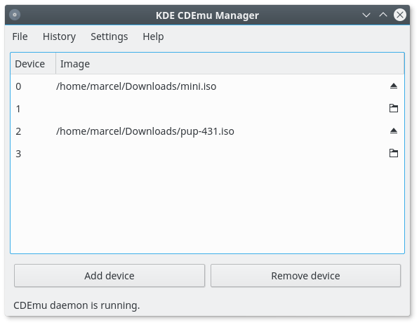

## KDE CDEmu Manager

KDE CDEmu Manager is a simple frontend for CDEmu.

It provides a small manager window that gives you an overview of your virtual drives and allows you to mount and unmount images.

It also includes a service menu for mounting images directly from Dolphin/Konqueror.

Images can be unmounted like any other media through Dolphin or the device notifier.
